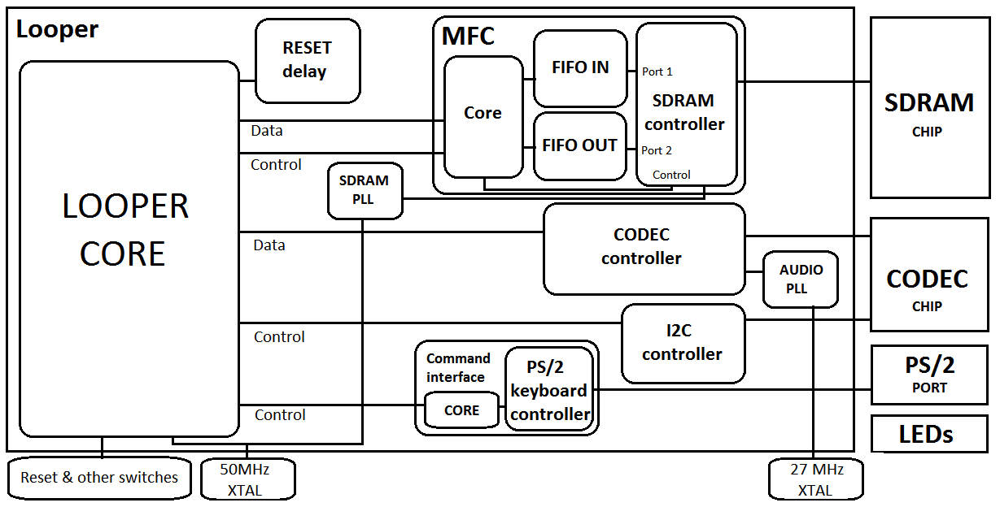
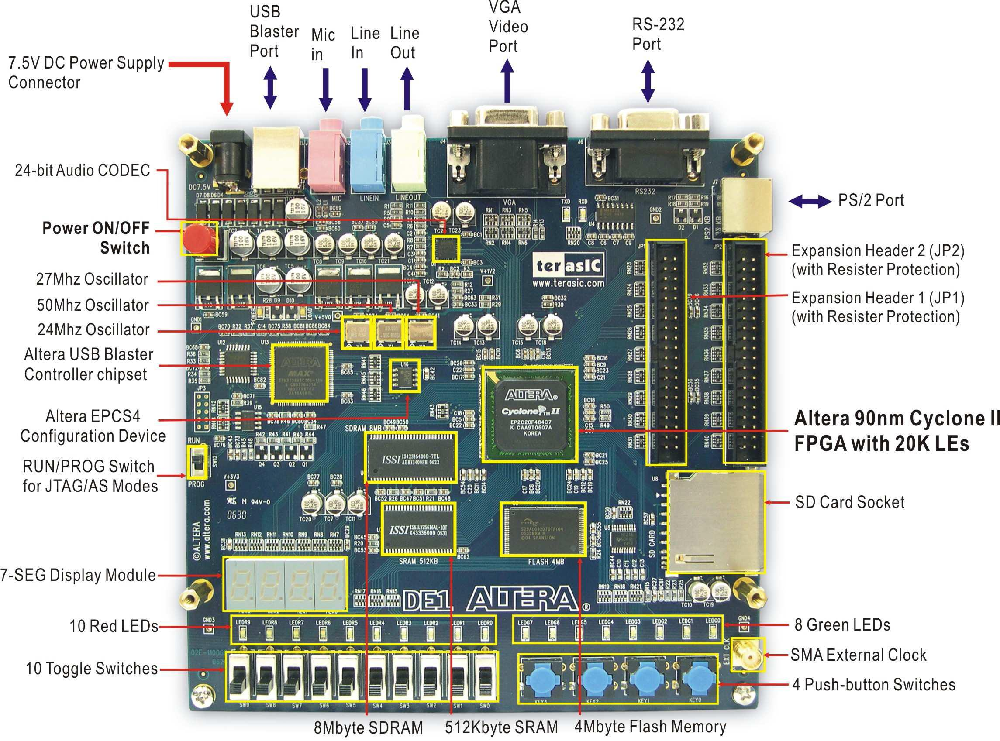

# FPGA Guitar Looper Pedal

> *A guitar looper pedal built out of FPGA primitives, before MCUs caught up.*

<p align="center">
  
</p>

A real-time, multi-layer **guitar looper pedal** implemented on an
**Altera DE1** development board (Cyclone II FPGA) in **VHDL**, with
**8 MB of external SDRAM** for audio storage and a **Wolfson WM8731**
audio codec for line-in / line-out. Hobby project, originally built
**2008–2009**.

The pedal records an electric-guitar signal into SDRAM on the press of
a foot-switch (which in this prototype was a **PS/2 keyboard's
spacebar** : no actual pedal hardware was built), starts looping it
back on a second press, and lets the player **layer additional
recordings on top** of the loop in real time, with each new pass
mixed into the running buffer.

Up to **47 seconds** of 24-bit, 44.1 kHz audio can be held in the
SDRAM before wrapping.

> The original 2013 write-up of the project (with photos and a
> retrospective even back then) is on my blog:
> [**pixelclock.wordpress.com**](https://pixelclock.wordpress.com/2013/08/11/a-homebrew-high-quality-guitar-looper-pedal/).
> This repository is the actual VHDL source, recovered from a NAS
> archive and published as a portfolio piece in 2026 under the MIT
> license.

## 🎧 Listen

Real captures from the running hardware. Players below; raw files
(both `.mp3` and audio-only `.mp4`) live in
[`docs/audio/`](docs/audio/).

**1. First successful record-and-loop cycle**

<video controls src="docs/audio/demo1.mp4"></video>

**2. One base layer + a second layer on top**

<video controls src="docs/audio/demo2.mp4"></video>

**3. Multi-layer build-up**

<video controls src="docs/audio/demo3.mp4"></video>

**4. Multi-layer build-up**

<video controls src="docs/audio/demo4.mp4"></video>

**5. Multi-layer build-up**

<video controls src="docs/audio/demo5.mp4"></video>

**6. Multi-layer build-up**

<video controls src="docs/audio/demo6.mp4"></video>

**7. Final demo session**

<video controls src="docs/audio/demo7.mp4"></video>

---

## Hardware target

<p align="center">
  
</p>

| | |
|---|---|
| Board | **Altera DE1** development kit |
| FPGA | **Altera Cyclone II** (EP2C20F484C7) |
| External memory | **8 MB SDRAM**, 16-bit wide, 100 MHz |
| Audio codec | **Wolfson WM8731** : 24-bit sigma-delta, line-in / line-out / headphone-out |
| Crystals | 50 MHz (system) + 27 MHz (audio reference) |
| Foot switch | PS/2 keyboard (Logitech wireless), spacebar mapped to the looper trigger |
| Toolchain | Altera Quartus II (the project predates Vivado / Quartus Prime) |
| Audio specs | 24-bit, 44.1 kHz mono, 132.3 kB/s, ≈ 47 s of recording capacity |

---

## Architecture

The system runs across **three PLL-derived clock domains** with
explicit crossing on the FIFO boundaries:

| Domain | Source | Drives |
|--------|--------|--------|
| **50 MHz** | Crystal | Main logic, FSMs, command interface |
| **100 MHz** | 50 MHz × 2 via PLL | SDRAM controller |
| **18.4 MHz** | 27 MHz × N/M via PLL | Audio codec serial clock |

Top-level dataflow (`Looper.vhd`):

```
                ┌──────────────┐
   Guitar in    │              │   Layered mix out
  ─────────────►│   WM8731     ├─────────────────►  to amp / headphones
                │   Codec      │
                └──────┬───┬───┘
                       │   │ I2S (18.4 MHz)
                  ┌────▼───┴─────┐
                  │  CODECC.vhd  │  ← I2S serial codec controller
                  │  + DACC.vhd  │
                  └────┬─────────┘
                       │ 16-bit samples (codec clk)
                  ┌────▼─────────┐
                  │  FIFO        │  ← clock-domain crossing
                  │  (Altera DC) │
                  └────┬─────────┘
                       │ (50 MHz / 100 MHz)
                  ┌────▼─────────┐         ┌────────────────┐
                  │  MFC.vhd     │◄────────┤ cmd_interface  │
                  │  Memory Flow │ rec/    │     .vhd       │
                  │  Controller  │ play/   │  (PS/2 → FSM)  │
                  └────┬─────────┘ layer   └────────┬───────┘
                       │ addr / data                │
                  ┌────▼─────────┐                  │
                  │  Altera AN-202 │                │
                  │  SDRAM ctrl   │                 │
                  │  (3rd party)  │                 │
                  └────┬─────────┘                  │
                       │                            │
                  ┌────▼─────────┐         ┌────────▼───────┐
                  │  Off-chip    │         │  PS/2 receiver │
                  │  8 MB SDRAM  │         │  (3rd party)   │
                  └──────────────┘         └────────────────┘
```

**My code** (in [`rtl/`](rtl/)) is the orchestration: top-level FSM,
audio I/O, memory orchestration, command translation. The SDRAM
controller itself, the PS/2 receiver, the I2C-to-codec configurer,
and the dual-clock FIFO megafunction were taken from the Altera /
DE1 reference design materials and are documented (but not
redistributed) in [`DEPENDENCIES.md`](DEPENDENCIES.md).

---

## Highlights

### 🧠 `MFC.vhd` : Memory Flow Controller

The central piece of it. The codec produces / consumes samples at
44.1 kHz (one every ~22.7 µs); the SDRAM serves data in bursts at
100 MHz with refresh cycles and access latencies. The MFC sits in
between with:

- A **write-side FIFO** that buffers codec input until almost-full,
  then issues a burst write to SDRAM.
- A **read-side FIFO** kept almost-full so the codec output stage
  never starves, with bursts prefetched as it drains.
- Internal **WAddr / RAddr / EOLAddr registers** that track the loop
  boundaries : `EOLAddr` is what fires the wrap and the start of
  layer-mix mode.
- A **flush-on-end-of-loop** discipline so no buffered tail data is
  lost when the loop point fires.

The "almost-full / almost-empty" thresholds were tuned empirically
on hardware until there were zero audible glitches at full traffic
(simultaneous record + playback + layer-mix).

See [`rtl/MFC.vhd`](rtl/MFC.vhd).

### 🔊 `CODECC.vhd` + `DACC.vhd` : I2S to the WM8731

Hand-rolled I2S serial path to the WM8731 in both directions, plus
the I2C-driven boot configuration of the codec's internal register
table. Runs entirely in the 18.4 MHz codec clock domain, with the
samples handed off through the dual-clock FIFO to/from the MFC.

See [`rtl/CODECC.vhd`](rtl/CODECC.vhd),
[`rtl/DACC.vhd`](rtl/DACC.vhd).

### 🎹 `cmd_interface.vhd` : PS/2 keyboard as foot-switch

A small FSM that consumes the scan-code stream from the PS/2
receiver and emits the five command pulses that drive the looper:

- **Start recording** (begin laying down the base loop)
- **End of loop / start playback** (define `EOLAddr` and start the wrap)
- **Begin layer recording** (mix new input into the existing loop)
- **Pause / resume layer recording**
- **Pause / resume playback**

Each command is mapped to a large, easy-to-find key on the keyboard
(Spacebar, Ctrl, etc.) because the real foot switch was never built :
this was a proof of concept run on a desktop, with the keyboard sitting
on the floor.

See [`rtl/cmd_interface.vhd`](rtl/cmd_interface.vhd).

### ⏱ Three clock domains, no audible glitches

The whole record / playback / layer loop has to stay inside the
22.7 µs sample budget at 44.1 kHz, with SDRAM refresh and burst
scheduling stealing time on the memory side. Getting this right
without glitches was the bulk of the work : the FIFO depths, the
near-full / near-empty thresholds, and the MFC priority discipline
all came from iterating against captured audio with the demos above
as the regression suite.

### 🎵 24-bit / 44.1 kHz audio path

The original 2008–2009 spec was "as good as a commercial pedal", which
at the time meant CD-quality. The WM8731 supports up to 32-bit / 96
kHz; this design used 24-bit / 44.1 kHz because that maxed out what
the SDRAM bandwidth budget permitted in the chosen burst scheme
without sacrificing the 47-second capacity. The codec's 24-bit
samples are stored as 16-bit words in SDRAM (the upper 16 bits of
each sample), which is the documented trade-off in the blog post.

---

## What I'd do differently in 2026

The 2013 write-up of this project already carried a candid
retrospective:

> *"Implementing it with an FPGA can be quite oversized and a bit
> expensive. There are a few microcontrollers featuring high pin count
> and internal SDRAM controller that can run the SDRAM as fast as
> 66 MHz."*

That was true in 2013. In 2026 it is even more true:

- **Move to an MCU.** A modern STM32H7, RP2040 with attached PSRAM,
  ESP32-S3, or Teensy 4.1 trivially does 24-bit / 48 kHz audio in
  one direction, has built-in I²S, plenty of RAM for several minutes
  of loops, and costs an order of magnitude less than an FPGA dev
  kit. Power draw drops to single-digit milliamps, the PCB shrinks,
  and the firmware is just C.
- **Keep an FPGA only if you want ultra-low latency or many
  simultaneous effect chains.** Above ~16 simultaneous channels with
  FFT-domain processing, the FPGA still wins. For a single-channel
  looper, it is overkill.
- **Modern HDL workflow if the FPGA path is kept:** **GHDL** /
  **Verilator** for simulation, **cocotb** for Python testbenches,
  **SymbiYosys** for formal verification of the FSMs, **GitHub
  Actions** for continuous simulation on PRs, and the
  **F4PGA / LibreLane** open toolchain on a board that supports it
  (Lattice iCE40 or ECP5 today; the DE1 was Quartus-only).
- **Real foot-switch hardware.** A $5 momentary footswitch +
  optoisolator into a GPIO is the right answer; the PS/2 keyboard
  hack made the demo possible but never belonged in a "product".
- **Saturating mix on layer-add.** The 2008 design summed signed
  16-bit samples directly:

  ```vhdl
  mixed_sample <= std_logic_vector((mem_in) + (mem_out));
  ```

  When the layered sum exceeds the int16 range, the high bit is
  truncated and the result wraps from +32767 to −32768 : audible as
  a sharp click each time it happens. The right fix is sign-extend
  to 17 bits, add, then clamp before truncating back to 16:

  ```vhdl
  signal sum_ext : signed(16 downto 0);
  ...
  sum_ext <= resize(mem_in, 17) + resize(mem_out, 17);

  mixed_sample <=
      x"7FFF" when sum_ext > to_signed( 32767, 17) else
      x"8000" when sum_ext < to_signed(-32768, 17) else
      std_logic_vector(sum_ext(15 downto 0));
  ```

  Costs one extra bit of adder, two comparators, and a 3:1 mux :
  fewer than 20 LUTs on the Cyclone II. Easy to miss when you are
  debugging the SDRAM controller at 3 a.m.; easy to fix once you
  notice.
- **A formal "what hardware did I produce" answer.** The PS/2 hack
  worked, but a real prototype would have meant a PCB with the
  WM8731, the SDRAM, a Cyclone IV or iCE40, the footswitches, and
  jacks : the next 80% of the project that the hobby never got to.

None of this invalidates what was built. It worked, it sounded good.
I put together hand-written HDL across a
multi-clock-domain audio path under hard real-time constraints. As a
2008 hobby project it did its job.

---

## What I built vs. what I integrated

**Authored by me (this repository's `rtl/`):**

- `Looper.vhd` : top-level wiring + control FSM
- `MFC.vhd` : Memory Flow Controller (≈ 17 KB, the largest single
  piece of original work in the project)
- `CODECC.vhd` : I2S serial codec controller
- `DACC.vhd` : DAC sub-module
- `cmd_interface.vhd` : PS/2 scan-code → looper command translator
- `LooperTop.vhd` : bench-top wrapper used during the codec
  configuration bring-up

**Integrated from the DE1 reference design / Altera reference
materials / vendor sim models** : these are documented in
[`DEPENDENCIES.md`](DEPENDENCIES.md) and are not redistributed in
this repository:

- The multi-port SDRAM controller (`Multi_Sdram`, ©2006 Altera)
- The PS/2 keyboard receiver (`ps2_keyboard.v`, ©2006 Altera)
- The I²C controller and codec configuration sequencer
  (`I2C_Controller.v`, `I2C_AV_Config.v`, ©2006 Altera)
- The dual-clock FIFO (Altera megafunction wizard)
- The PLL primitives wrapping the on-board crystals
- The Micron behavioural SDRAM model used during simulation only

The purpose of this repo is to show how those pieces were
**glued together** under audio real-time constraints.

---

## Companion repositories

This repo is part of a longer arc of portfolio publications:

- [**`melbits-pod-firmware`**](https://github.com/mikedottech/melbits-pod-firmware)
  : Embedded firmware (C, nRF52810, BLE) for the Melbits POD smart
  toy, shipped 2020.
- [**`melbits-pod-comms`**](https://github.com/mikedottech/melbits-pod-comms)
  : Cross-platform Unity / C# comms library for the same product.

This FPGA project, from 2008–2009, is the oldest piece I'm
publishing : it sits at the start of the trajectory.

---

## My role

Solo hobby project. Designed, written, simulated, and brought up on
real hardware by me, on my own time, on a DE1 development kit I had
at home. Some of the building blocks (SDRAM controller, PS/2
receiver, I²C controller, FIFO megafunction) were taken straight from
the DE1 reference design and Altera reference materials : see
[`DEPENDENCIES.md`](DEPENDENCIES.md). The integration, the
real-time constraints, the audio path, and the looper logic itself
were written by me.

---

## License

Source code in this repository is released under the **MIT License**
: see [`LICENSE`](LICENSE) for the full terms. The audio demos and
images in `docs/` are released under the same MIT terms.

Third-party reference cores used in the original 2008–2009 working
project are **not redistributed here**; they remain the property of
their respective vendors under their original license terms. See
[`DEPENDENCIES.md`](DEPENDENCIES.md).

---

## Author

**Miguel Angel Exposito** 
[LinkedIn](https://www.linkedin.com/in/miguel-angel-exposito) ·
[GitHub](https://www.github.com/mikedottech)
